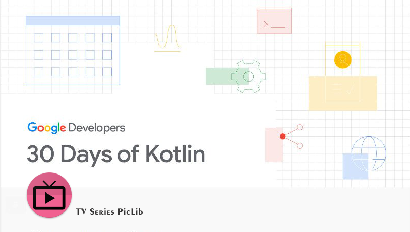
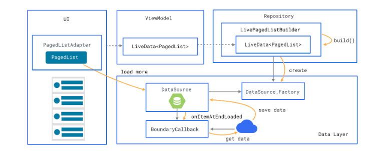
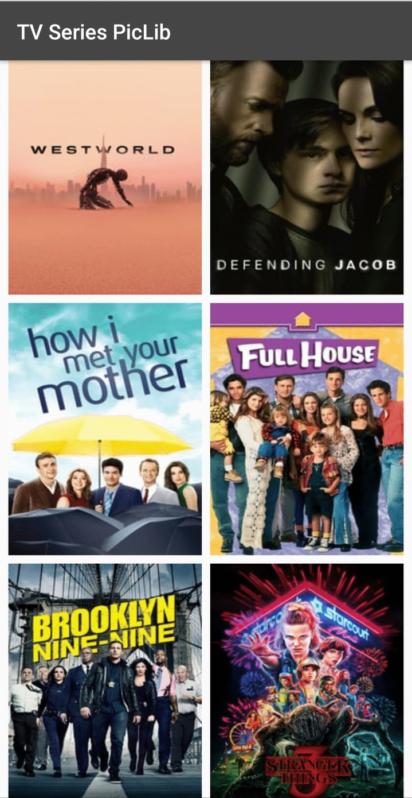

# TV_Series_PicLib

Kotlin Project to understand and develop something useful. So I tried with Picture Library of Tv Series under campign **#30DaysOfKotlin**. This project is inpired from [erikjhordan-rey/Movies-PagingLibrary-Arch-Components](https://github.com/erikjhordan-rey/Movies-PagingLibrary-Arch-Components)

### Codelab helps to understand below mentioned topics

- [**Paging Library:**][1] The Paging Library makes it easier for you to load data on demand within your app's RecyclerView.

- [**PagedList:**][2] Collection that loads data in pages, asynchronously. A PagedList can be used to load data from sources you define, and present it easily in your UI with a RecyclerView.
- [**DataSource**][3] and [**DataSource.Factory:**][4] DataSource is the base class for loading snapshots of data into a PagedList. A DataSource.Factory is used to create a DataSource.

- [**LivePagedListBuilder:**][5] Class used to build a LiveData<PagedList> based on DataSource.Factory and a PagedList.Config.

- [**BoundaryCallback:**][6] Helper callback to signals when a PagedList has reached the end of available data.
- [**PagedListAdapter:**][7] RecyclerView.Adapter that presents paged data from PagedLists in a RecyclerView. PagedListAdapter listens to PagedList loading callbacks as pages are loaded, and uses DiffUtil to compute fine grained updates as new PagedLists are received.

[1]: https://codelabs.developers.google.com/codelabs/android-paging/index.html?index=..%2F..%2Findex#2
[2]: https://developer.android.com/reference/android/arch/paging/PagedList.html
[3]: https://developer.android.com/reference/android/arch/paging/DataSource.html
[4]: https://developer.android.com/reference/android/arch/paging/DataSource.Factory.html
[5]: https://developer.android.com/reference/android/arch/paging/LivePagedListBuilder.html
[6]: https://developer.android.com/reference/android/arch/paging/PagedList.BoundaryCallback.html
[7]: https://developer.android.com/reference/android/arch/paging/PagedListAdapter.html

### Resources used for Paging Library on Android

- [Paging library overview Android by Google][8]
- [Paging Library CodeLab][9]
- [Android Track Learning from CS50][10]
- [PagingWithNetworkSample][11]

[8]: https://developer.android.com/topic/libraries/architecture/paging/
[9]: https://codelabs.developers.google.com/codelabs/android-paging/index.html?index=..%2F..%2Findex#0
[10]: https://cs50.harvard.edu/x/2020/tracks/mobile/android/
[11]: https://github.com/googlesamples/android-architecture-components/tree/master/PagingWithNetworkSample

#### App Glimpse

Developed By
------------

* Erik Jhordan Rey  - <erikjhordan.rey@gmail.com>

Modified By
------------

* Avi Kathuria  - <avikathuria21@gmail.com>

License
-------

    Copyright 2018 Erik Jhordan Rey

    Licensed under the Apache License, Version 2.0 (the "License");
    you may not use this file except in compliance with the License.
    You may obtain a copy of the License at

       http://www.apache.org/licenses/LICENSE-2.0

    Unless required by applicable law or agreed to in writing, software
    distributed under the License is distributed on an "AS IS" BASIS,
    WITHOUT WARRANTIES OR CONDITIONS OF ANY KIND, either express or implied.
    See the License for the specific language governing permissions and
    limitations under the License.

